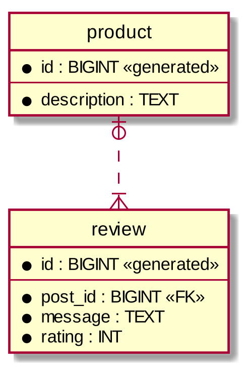

# **Домшнее задание**

Домашнее задание можно будет выбрать либо из [списка](#task-list), либо предложить самому до **14 июня 2023**. В случае если предложен свой мини-проект, то он должен обязательно покрыть перечень обязательных **`[о]`** две дополнительные **`[д]`** темы:
- **`[о]`** Многопоточность — любая комбинация из Thread/Executor/конрурентные коллекции/*Locks/CompletableFuture/intrinsic locks/.... _(быть готовым дискутировать на тему happens-before)_
- **`[о]`** Стандартные коллекции, stream API и/или functional interfaces _(быть готовым пообщаться на тему трейдофов выбора той или иной реализации, механики захвата переменных из контекста, работе стримов)_
- **`[о]`** I/O — работа с файлами/сетью, аккуратная работа с charset
- **`[д]`** Reflection API и/или Annotations — интроспекция классов и/или вызовы методов через рефлексию и/или чтение ресурсов
- **`[д]`** Bytecode — эксперименты с генерацией классов приветствуются 😅
- **`[д]`** SpringBoot — контроллер, «слоистая архитектура», хранение состояния в базе данных (h2 пойдёт). Грамотно применённый AOP приветствуется

Предложенный проект не должен быть слишком тривиальным, но и не хардкорным настолько чтобы не успеть до дедлайна (**27 июня 2023**). Требования необходимо согласовать с преподавателем.

### Правила сдачи
- Maven для запуска сборки и прогона тестов. тесты обязательны. Артефакт сборки — либо docker образ либо executable jar либо native-image
- Сдачу задач ведем в отдельных приватных репозиториях на github, обсуждения ведём в pr
- Задание считается принятым, если вы отправили PR, получили ок у преподавателя
- Ок предполагает защиту. Защита будет в виде теоретических вопросов по коду не выходящие за рамки зачитанного курса лекций и касательно выбранных выше тем. Предполагается не более 4х вопросов по теории
- В случае необходимости преподаватель может провести очную защиту по согласованию со студентом
- До дедлайна необходимо успеть не только отправить PR, но и пройти защиту ДЗ
- **Хард дедлайн сдачи — 27е июня 2023**

### За что снимаются баллы
— Опоздание со сдачей задания (-1 балл)
— Сдача задания, в котором не проходят или отсутствуют тесты на базовые сценарии, большое количество багов в задании (max -0.5 балла)
— За каждый неотвеченный теоретический вопрос -0.05 баллов (не более -0.2 в сумме)

### За что добавляются баллы

Использование лучших практик из курса, уверенное владение языком, нетривиальный проект — +0.2 балла max

### Выставление оценки
Консолидированная оценка по домашке в общей формуле `min([0.0 ... 1.2], 1) * 0.4`


# **Список заданий** <a name="task-list"></a>

## Многопоточный калькулятор

Консольная утилита, позволяющая делать многопоточные вычисления со скобками. На вход программа должна уметь принимать файл-задание оговоренного формата и выводить в консоль результат исполнения задания. 

Формат файла:
```
{class_fqcn},{command_id}
{mehod}[,{command_id}]*
...
```

Файл состоит из заголовка (первая строка) и списка команд (последующие строки). Команды идентифиуируются последовательно начиная с `0` (далее `{command_id}`) и могут использоваться в качестве аргументов в последующих вычислениях.

В заголовке указывается полноквалифицированное имя класса-обработчика `{class_fqcn}` и через запятую идентификатор команды `{command_id}`, после которой калькулятор должен прервать исполнение и вывести полученный результат. Каждая команда состоит из `{method}` - имя метода объекта-обработчика и списка аргументов-команд, указанных через запятую.  

**Пример**

*Обработчик*

```java
package ru.hse.cs.java.assesment;

import java.util.concurrent.ThreadLocalRandom;

public class SimpleHandler {
    public Double rnd() {
        return ThreadLocalRandom.current().nextDouble();
    }

    public Double mul(Double a, Double b) {
        return a * a;
    }

    public Double sum(Double a, Double b) {
        return a + b;
    }
}
```

*Задание*
```
ru.hse.cs.java.assesment.SimpleHandler,4
rnd
rnd
mul,0,1
rnd
sum,2,3
```

В предложенном примере корректно реализованный калькулятор выведет в консоль результат вычисления выражения `sum(mul(rnd(), rnd()), rnd())` (т.е `rnd() * rnd() + rnd()`).

### Требования

Калькулятор должен обрабатывать каждую команду в отдельном потоке.

### Допущения

При реализации можно считать что
- Формат подаваемого файла корректный (нет необходимости в валидации)
- В заданиях отсутствуют циклы
- Тип аргументов и возвращаемого значения методов обработчика `Double`
- Реализация обработчика потокобезопасна

Снятие допущений приветствуется :)

### Теги

`Collections`, `I/O`, `Reflection`, `Multithreading`

---

## Библиотека для сбора статистики обращений к бинам в Spring

Разработать библиотеку, позволяющую разаботчику собирать in-memory статистику вызова методов бинов, а так же rest-контроллер, позволяюий получить эту статистику целиком и для конкретного бина по полноквалифицированному имени класса. 

### Требования

Необходимо предоставить разработчику аннотацию, которой можно разметить либо бин целиком (тогда статистика собирается для всех методов), либо отдельные методы. 

Собираемая статистика: 
- Количество успешных вызовов
- Количество вызовов, завершившиеся ошибкой
- Количество вызовов in-flight ("в моменте")
- Максимальное время исполнения

## Теги

`Spring Boot`, `AOP`, `Reflection`, `Multithreading`

---

## Рекурсивное копирование файлов

Наприсать консольную утилиту, принимающую на вход директорию-источник, директорию-назначение и размер пула потоков. Программа должна скопировать все файлы из источника в назначение с сохранением структуры поддиректорий.

### Требования

Желательно использовать NIO. Чтобы пользователю было не скучно предлагается периодически логировать сколько процентов (от суммарного размера файлов) уже было скопировано и сводную информацию перед завершением работы - сколько файлов и байт было скопировано успешно и сколько файлов не удалось скпопировать. 

### Допущения

При обходе директории можно не учитывать симлики. Снятие допущений приветствуется :)

### Теги

`Collections`, `I/O`, `Multithreading`

---

## Отзывы на товары

Написать сервис, позволяющий добавлять, изменять товары, а так же добавлять отзывы с оценками.

### Требования

Реализовать сервис в духе «слоистой архитектуры» - rest-контроллер, сервис с бизнес-логикой и слой хранения данных (в качестве базы данных можно использовать h2). Минималистичная модель данных (можно расширять):



Контроллер должен предоставить следующие эндпоинты:

- `POST /product` - создение продукта
- `GET /product/{product_id}` - получение продукта с комментариями. В ответе сервера должен присутствовать средний рейтинг продукта основанный на всех отзывах
- `DELETE /product/{product_id}` - удаление продукта
- `POST /product/{product_id}/review` - добавление отзыва

### Теги

`Spring Boot`, `ORM`

---

## Генератор стаб-объектов

Реализовать библиотеку, позволяющую в рантайме генерировать классы-наследники для любого заданного интерфейса с последующим их инстанциированием.

### Требования

Общая идея интерфейса библиотеки
```java
public interface SutbGenerator {

    /**
     * Генератор уникальных stub-классов.
     *
     * @param iface интерфейс
     * @return stub-класс
     * @throws IllegalArgumentException если поданный класс не является интерфейсом
     */
    <T> Class<T> generateStubClass(Class<T> iface);

    /**
     * Инстанциатор stub-классов.
     *
     * @param clazz stub-класс
     * @return инстанс stub-класса
     */
    <T> T instantiateStubClass(Class<T> clazz);
}
```

Сгенерированный класс должен:
- иметь уникальное имя
- находиться в виртуальном пакете `ru.hse.cs.java.generated`
- каждый экземпляр stub-класса должен иметь уникальный идентификатор (можно `long`)
- корректно реализовать `equals`, `hashCode` и `toString` (все три должны учитывать идентификатор)
- все реализации методов интерфейса должны логировать вызов (имя метода и параметры) и возвращать значения по-умолчанию (`null`, `0L`, ...)

### Теги

`Collections`, `Bytecode`, `ClassLoader`, `Reflection`
